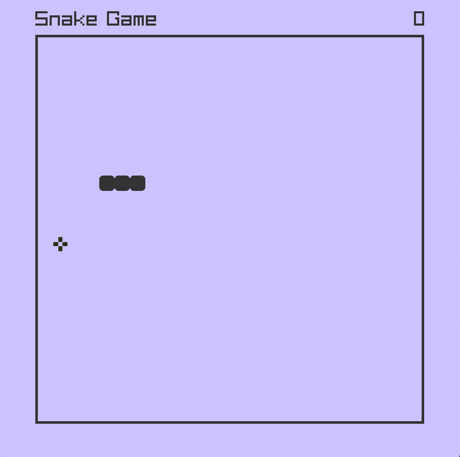

# Snake Game

A simple Snake Game implemented in C++ using the **Raylib** graphics library.

## How to Play
- **Movement**: Use the arrow keys to move the snake up, down, left, or right.
- **Objective**: Eat food to grow and increase your score.
- **Game Over**: The game ends if the snake collides with itself or the boundaries of the screen.

## Features
- **Snake Movement**: The snake moves across a grid, growing with each food consumed.
- **Random Food Placement**: Food is generated in random positions, avoiding overlap with the snake's body.
- **Score Tracking**: Your score increases as you eat food.
- **Collision Detection**: The game checks for collisions with food, edges, and the snake's own body.

## Controls
- **Up Arrow**: Move up
- **Down Arrow**: Move down
- **Left Arrow**: Move left
- **Right Arrow**: Move right

## Project Structure
- `main.cpp`: Contains the entire game logic including the snake movement, food generation, and game state handling.

## License
This project is licensed under the MIT License.
